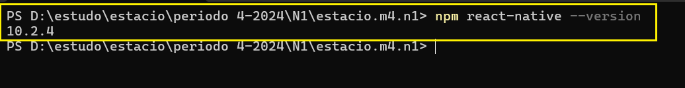
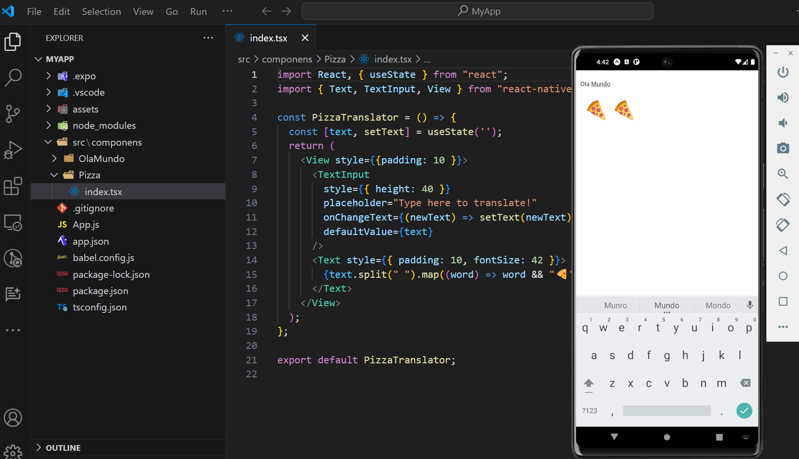

# Missão Prática | Nível 1 | Mundo 4

Objetivos da prática

Configurar o ambiente de desenvolvimento React Native;
Implementar a funcionalidade de entrada de texto em um componente React Native;
Implementar um Componente de Lista Dinâmica (ScrollView);
Implementar componentes React Native para exibir informações de forma dinâmica
em listas;
Empregar elementos visuais em um aplicativo React Native.

## Microatividade 1: Configurar o ambiente de desenvolvimento React Native

- Material necessário para a prática

Editor de texto ou IDE sendo opções sugeridas: Notepad++, Nano Editor, VS Code;
Navegador Web: Google Chrome, Firefox, MS Edge, Safari ou Opera;
Node.js e npm;

- Procedimentos

Esta atividade tem como objetivo preparar a configuração do ambiente de
desenvolvimento React Native para a plataforma Windows, MacOS e Linux,
fornecendo-lhes as ferramentas essenciais e orientações para começar a criar
aplicativos móveis com esta tecnologia.  

No meu caso foi feito para ambiente Windows

Instalando o VSCODE : https://code.visualstudio.com/

Instalando o React Native no Windows : https://nodejs.org/en/download/

Instalando o Node :  https://nodejs.org/en
 
Instalando o react-native : https://reactnative.dev/docs/environment-setup

2. Após a conclusão das instalações, você pode verificar se o Node.js e o npm estão
instalados abrindo um prompt de comando e executando os seguintes comandos:

> node --version 
> npm  --version

 
 - react-native

Optei pelo Expo pois é uma plataforma de desenvolvimento que facilita a criação de aplicativos React Native.

Ele fornece uma variedade de ferramentas e recursos, incluindo: 

   - Uma CLI que permite que você crie, configure e execute aplicativos React Native.
   - Um conjunto de APIs pré-construídas que você pode usar para adicionar funcionalidades comuns ao seu aplicativo, como autenticação,      geolocalização e push notifications.
   -Um ambiente de desenvolvimento online que permite que você crie e teste seus aplicativos sem precisar instalar nenhum software em seu computador.

obs: outro detalhe foi optar o yarn ao invés do npm que tem foco na velocidade, segurança e confiabilidade.

>npm install --global yarn

4. Agora abra um prompt e vá para o diretório onde você deseja que o projeto fique e execute o seguinte comando:

> npx create-expo-app MyApp

    
5. Depois que o projeto for criado, vá para o diretório do projeto executando o seguinte
comando no prompt de comando:

> cd MyApp

> code .

 
6. Substitua “my-app” pelo nome do diretório do projeto "MyApp". Agora, inicie o servidor de
desenvolvimento executando o seguinte comando:

> yarn start ou  npm start 

 ### Configurações adicionais

 - Instalação do Android Studio  

  Vá para https://developer.android.com/?hl=pt-br 
  
  procure logo abaixo por "Fazer download do android studio"

 

 

- No meu caso minha instalação ficou assim :

Android Studio Giraffe | 2022.3.1 Patch 3
Build #AI-223.8836.35.2231.11005911, built on October 25, 2023
Runtime version: 17.0.6+0-b2043.56-10027231 amd64
VM: OpenJDK 64-Bit Server VM by JetBrains s.r.o.
Windows 11 10.0
GC: G1 Young Generation, G1 Old Generation
Memory: 1280M
Cores: 8
Registry:
    external.system.auto.import.disabled=true
    ide.text.editor.with.preview.show.floating.toolbar=false

Non-Bundled Plugins:
    Dart (223.8977)
    io.flutter (76.3.2) 

- Android Studio

 

  
- Android SDK 

  
 

   
 - Emulator : No meu caso, optei por executar o emulador via arquivo bat
  
  

   
- Final Microtavidade 1

   
 
 
 

## Microatividade 2 : Implementar a funcionalidade de entrada de texto em um componente React Native

- Criar pasta 'src' e em seguida pasta 'components\index.tsx' 

   
 

  

  - Resultados esperados

Ao seguir esses passos, você terá implementado com sucesso a
funcionalidade de entrada de texto em um componente React Native. O
componente permitirá que o usuário insira texto e o traduzirá para
emojis de pizza, similar ao exemplo fornecido.

## Microatividade 3: Implementar um Componente de Lista Dinâmica (ScrollView)

- Nessa atividade, optei por experimentar outro tamanho de fontes assim como criação de estilos

 

 
- Outro ponto foi considerar cada microatividade como sendo um compomente

 

