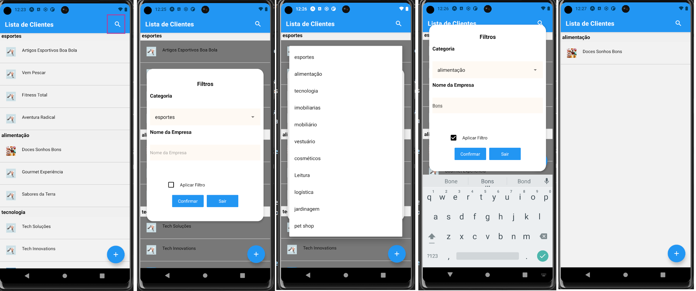

# Missão Prática | Nível 1 | Mundo 4


- Introdução

```
Esta atividade esta dividida em duas partes sendo a primeira a 
de Microatividades (Parte 1) e a segunda, desenvolvimento de um App (Parte 2)
```


- Objetivos da prática
```
   - Configurar o ambiente de desenvolvimento React Native;
   - Implementar a funcionalidade de entrada de texto em um componente React Native;
   - Implementar um Componente de Lista Dinâmica (ScrollView);
   - Implementar componentes React Native para exibir informações de forma dinâmica em listas.
   - Empregar elementos visuais em um aplicativo React Native.
``` 

 - Especificação

https://sway.cloud.microsoft/s/veoX3PzlNFANdKWA/embed


- obs: cada microatividade esta sendo representada como um compomente

# Microatividades (Parte 1)


## 1 - Configurar o ambiente de desenvolvimento React Native

- Material necessário para a prática

Editor de texto ou IDE sendo opções sugeridas: Notepad++, Nano Editor, VS Code;
Navegador Web: Google Chrome, Firefox, MS Edge, Safari ou Opera;
Node.js e npm;

- Descrição
``` 
Esta atividade tem como objetivo preparar a configuração do ambiente de
desenvolvimento React Native para a plataforma Windows, MacOS e Linux,
fornecendo-lhes as ferramentas essenciais e orientações para começar a criar
aplicativos móveis com esta tecnologia.  

No meu caso foi feito para ambiente Windows
``` 
Instalando o VSCODE : https://code.visualstudio.com/

Instalando o android studio : https://bit.ly/492ToHS

Instalando o React Native no Windows : https://nodejs.org/en/download/

Instalando o Node :  https://nodejs.org/en
 
Instalando o react-native : https://reactnative.dev/docs/environment-setup

2. Após a conclusão das instalações, você pode verificar se o Node.js e o npm estão
instalados abrindo um prompt de comando e executando os seguintes comandos:

> node --version 
> npm  --version


 
 - react-native


Optei pelo Expo pois é uma plataforma de desenvolvimento que facilita a criação de aplicativos React Native.

Ele fornece uma variedade de ferramentas e recursos, incluindo: 

   - Uma CLI que permite que você crie, configure e execute aplicativos React Native.
   - Um conjunto de APIs pré-construídas que você pode usar para adicionar funcionalidades comuns ao seu aplicativo, como autenticação,      geolocalização e push notifications.
   -Um ambiente de desenvolvimento online que permite que você crie e teste seus aplicativos sem precisar instalar nenhum software em seu computador.

obs: outro detalhe foi optar o yarn ao invés do npm que tem foco na velocidade, segurança e confiabilidade.

>npm install --global yarn

4. Agora abra um prompt e vá para o diretório onde você deseja que o projeto fique e execute o seguinte comando:

> npx create-expo-app MyApp

    
5. Depois que o projeto for criado, vá para o diretório do projeto executando o seguinte
comando no prompt de comando:

> cd MyApp

> code .


<BR>
6. Substitua “my-app” pelo nome do diretório do projeto "MyApp". Agora, inicie o servidor de
desenvolvimento executando o seguinte comando:

> yarn start ou  npm start 


 ### Configurações adicionais

 - Instalação do Android Studio  

  Vá para https://developer.android.com/?hl=pt-br 
  
  procure logo abaixo por "Fazer download do android studio"

 

<BR>

- No meu caso minha instalação ficou assim :

``` 
Android Studio Giraffe | 2022.3.1 Patch 3
Build #AI-223.8836.35.2231.11005911, built on October 25, 2023
Runtime version: 17.0.6+0-b2043.56-10027231 amd64
VM: OpenJDK 64-Bit Server VM by JetBrains s.r.o.
Windows 11 10.0
GC: G1 Young Generation, G1 Old Generation
Memory: 1280M
Cores: 8
Registry:
    external.system.auto.import.disabled=true
    ide.text.editor.with.preview.show.floating.toolbar=false

Non-Bundled Plugins:
    Dart (223.8977)
    io.flutter (76.3.2) 

``` 
- Android Studio

 

 <BR>
- Android SDK 

 <BR>
 

  <BR>
 - Emulator : No meu caso, optei por executar o emulador via arquivo bat
  
 <BR>


  <BR>

Resultados esperados
```
Esta atividade permite a instalação do React native, preparando o
ambiente para as primeiras construções básicas para futura criação do
aplicativo. Se tudo correu bem, você deverá ver a logo do React em seu
navegador após a instalação.
```
 <BR> 
 
 
<br>

# Inicio das Microatividades (Compomentes)

```
 Foi adaptado um menu drawer para o acesso as atividades porem serão mantidas a imagems 
 que indica a chamadas originais aos compomentes assim como a numerção das atividades, 
 como forma de referência a especificação original.  


``` 
<BR> 
 
 
<br>

## 2 - Implementar a funcionalidade de entrada de texto em um componente React Native

- Descrição:
```
Nesta atividade, foi a de implementar a funcionalidade de
entrada de texto em um componente React Native. Tambem criamos um
componente que permite aos usuários inserir textos e ver a tradução
desse texto em forma de emojis de pizza. Isso envolve o uso do
componente TextInput, a manipulação de eventos de alteração de
texto (onChangeText), e a exibição do resultado traduzido em tempo
real. Ao final desta atividade, se tem um componente React Native
funcional que demonstra uma interação de entrada de texto.
```

- Criar pasta 'src' e em seguida pasta 'components\index.tsx' 

 <BR> 
 

 <BR>

  - Resultados esperados
```
Ao seguir esses passos, você terá implementado com sucesso a
funcionalidade de entrada de texto em um componente React Native. O
componente permitirá que o usuário insira texto e o traduzirá para
emojis de pizza, similar ao exemplo fornecido.
```


## 3 - Implementar um Componente de Lista Dinâmica (ScrollView)

- Descrição
```
Nesta atividade, foi a criar um componente de lista que
permite exibir informações de forma dinâmica em um aplicativo React
Native. Isso é útil quando você deseja criar uma lista que pode conter
vários tipos de elementos, como texto e imagens, e que pode ser
rolada verticalmente.
```

- Nessa atividade, optei por experimentar outro tamanho de fontes assim como criação de estilos

<BR>


<BR>

 Resultados esperados

 ``` 
Ter criado um componente React Native que permite exibir informações de 
forma dinâmica em uma lista rolável, contendo elementos heterogêneos, 
como texto e imagens. Isso é útil para criar interfaces de usuário 
mais complexas e interativas em seu aplicativo. A seguir são apresentadas 
imagens do resultado após a execução do código.
``` 
<BR>


## 4 - Criando o visualizador de listas

- Descrição
``` 
Criar um componente React Native que permitirá exibir informações de forma 
dinâmica em uma lista. Isso é útil quando você tem um grande conjunto de 
dados e deseja que apenas os itens visíveis sejam renderizados para economizar recursos.

``` 
## 4.1. Criando uma Lista Simples:

- Lista simples usando flatList (você pode substituir os nomes da lista de acordo com sua
necessidade)


## 4.2. Criando uma Lista com Seções:

Lista com seções lógicas, talvez com cabeçalhos de seção, então um SectionList é o caminho a percorrer.
Usando uma SectionList:


 Resultados esperados
``` 
Ter um componente React Native que pode exibir informações de forma dinâmica 
em uma lista, economizando recursos ao renderizar apenas os itens visíveis na tela.
Poder personalizar esses componentes para atender às suas necessidades específicas ao 
trabalhar com grandes conjuntos de dados.
``` 

## 5 - Empregar imagens,seja para exibir gráficos, ícones, fotos ou outros elementos visuais em um aplicativo React Native


- Descrição
``` 
Incorporar imagens em um aplicativo React Native. Imagens são usadas para exibir gráficos,
ícones, fotos e outros elementos visuais em um aplicativo.  
``` 

Imagens de diferentes fontes, incluindo armazenamento local, rede e um esquema 'data:':

<BR>


<BR>
Aqui foram adicionados estilos a uma imagem

<BR>


<BR>

Resultados esperados
 
```
Ter incorporado imagens ao aplicativo React Native e aprendido a aplicar estilos 
às imagens para personalizá-las de acordo com suas necessidades.
```

## 6 Composição do app do Gato

- Neste ultimo exercicio, modifique a funcionalidade para que utilizasse eventos e estado com isso o resultado foi que ao se digitar o nome, este é condiderado no dialogo.

<BR>


<BR>

# Desenvolvimento de um App (Parte 2) 

- Descrição
```
Nessa atividade é tudo o que utilizado tudo que foi apresentado nas micro
atividades anteriores. Além disso, também é varificado como o React
Native responde a eventos.
```

- Contextualização
```
A empresa "Meeting" busca criar um aplicativo móvel eficaz para o
cadastro de fornecedores, com listas e imagens de alta qualidade,
economizando recursos e proporcionando uma excelente experiência
ao usuário. A escolha da tecnologia React Native é crucial para
estabelecer uma presença sólida no mercado móvel. Nesta atividade,
você aprenderá os princípios básicos do React Native.
```
Requisitos Funcionais:

- Cadastro de Fornecedores: O aplicativo deve permitir o cadastro
de fornecedores, incluindo informações detalhadas, como nome,
endereço, contato e categorias de produtos fornecidos. Essas
informações serão exibidas utilizando componentes como <Text>,
<TextInput>, e <Image>.

- Listagem de Fornecedores: Deve ser possível visualizar uma lista
de fornecedores cadastrados, com opções de pesquisa e filtragem
com base em critérios como categoria ou localização. A lista de
fornecedores será exibida utilizando componentes como <Text> e
<Image>.

- Associação de Imagens: O aplicativo deve permitir a associação de
imagens aos perfis dos fornecedores. Os usuários devem poder
fazer o upload de logotipos ou fotos relacionadas ao fornecedor,
utilizando o componente <Image>.

- Experiência de Usuário Intuitiva: A interface do aplicativo deve ser
intuitiva e fácil de usar, garantindo que os usuários possam
navegar, adicionar e editar informações de forma eficiente. Isso
será alcançado usando componentes como <Text>, <TextInput>,
e <Image>.

## Apresentação do aplicativo

 - Aplicativo 'MeetingApp' tem o objetivo de atender as demandas basicas, tendo um start apartir de uma 
 lista pré estabelecida para podemos fazer filtros e edições,remoções e cadastros.

 
<BR>


<BR>

 - Foi utilizado o 'Expo' que é uma plataforma de desenvolvimento que facilita a criação de aplicativos 
 React Native.
 
 - Para sua execução esteja na pastas do projeto 'meetingApp' abra o prompt de comando e execute
 '> npx expo start' considerando que o emulador do android já esteja ativo
  
<BR>


<BR>

 - A apresentação esta em forma de lista com seções onde temos imagens associadas a cada item que podem ser 
 alteradas realizando-se um click sobre os mesmos onde é apresentada uma tela para edição e remoção


<BR>


<BR>

 - A adição é feita clicando no 'floating button +' abaixo a direita e o filtro no button acima a direita


<BR>


<BR>

- As edições,remoções são executadas através de um click sobre o item da lista onde será apresentada
uma tela onde é possivel alterar qualquer campo

<BR>


<BR>

- obs1: a carga inicial e feita através de arquivos 'MOCKs' tanto para a lista de clientes
como para as categorias

- obs2: as operações de CRUD não são persistidas em banco,api ou local storage, são manipulados
em memoria através de um Context Provider, sendo assim, o mock clientes não é alterado 

- obs3: devido as images ***não serem armazenadas no dispositivo e se tratarem de 'links' com imagens 
da internet***  , sua renderização vai depender da 'qualidade de internet' tanto no seu aparelho 
quanto no host de origem 

<BR>


<BR>

- A aplicação do filtro é acionada através do botão 'lupa' acima a direita onde 
é apresentado um 'form modal' modal com as opções de filtro que são, categorias
e conteudo do nome da empresa. Tambem existe um compomente 'chek-box' onde e
feito o controle se o filtro esta ou não aplicado a lista.
 
 
<BR>


<BR>

- obs: a remoção da aplicação do filtro é feita voltando a tela de filtro e 
removendo a seleção do 'check-box' e confirmando.

 
<BR>


<BR>

## Organização do código 

  Estruturalmente o código esta dividido em :


1. **Navegação e Estrutura**:
   - O aplicativo utiliza a biblioteca `@react-navigation/native` para gerenciar a navegação entre diferentes telas, como a lista de clientes, cadastro de novos clientes, e edição de clientes existentes.

2. **Contexto de Clientes**:
   - Implementa um contexto global (`ClientesContext`) para gerenciar o estado dos clientes, permitindo adicionar, remover, atualizar e filtrar clientes, além de buscar clientes por ID e recuperar todos os clientes em seu formato original ou filtrado.

3. **Filtragem e Visualização de Clientes**:
   - Oferece funcionalidades para filtrar clientes por categoria e nome da empresa, exibindo os resultados filtrados em uma tela específica (`ClientesFiltrados`). Utiliza um checkbox personalizado (`CustomCheckbox`) para ativar ou desativar o filtro de clientes.

4. **Edição de Clientes**:
   - Permite a edição de detalhes de clientes específicos, como nome, telefone, cidade, estado, email, e imagem, através de uma tela de edição (`EditarScreen`). Os dados podem ser atualizados ou o cliente pode ser removido.

5. **Cadastro de Clientes**:
   - A tela de cadastro (não detalhada nos códigos fornecidos, mas inferida pela estrutura) permitiria adicionar novos clientes ao sistema, especificando informações como categoria, nome, contato, localização, e imagem.

6. **Componentes Reutilizáveis**:
   - Utiliza componentes reutilizáveis, como `CardCliente` para exibir informações de clientes em um formato de cartão, e `CustomCheckbox` para criar um checkbox personalizado que pode ser usado em diferentes partes do aplicativo.

7. **Estilização e Layout**:
   - Aplica estilos específicos para criar uma interface de usuário coesa e amigável, utilizando `StyleSheet` do React Native para definir o layout e a aparência dos componentes visuais.

8. **Dados Mockados**:
   - Emprega dados mockados para categorias de clientes (`serverCategorias`) e informações de clientes (`server`), simulando um backend para o desenvolvimento e teste do aplicativo.

Em resumo, o aplicativo oferece uma solução completa para o gerenciamento de clientes, desde a visualização e filtragem até o cadastro e edição de informações, tudo dentro de um contexto global acessível por diferentes componentes e telas, proporcionando uma experiência de usuário fluida e integrada em dispositivos móveis.
