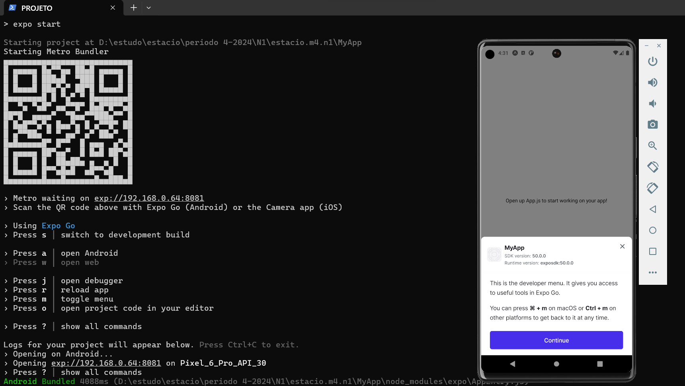

# Missão Prática | Nível 1 | Mundo 4

Objetivos da prática

Configurar o ambiente de desenvolvimento React Native;
Implementar a funcionalidade de entrada de texto em um componente React Native;
Implementar um Componente de Lista Dinâmica (ScrollView);
Implementar componentes React Native para exibir informações de forma dinâmica
em listas;
Empregar elementos visuais em um aplicativo React Native.

## Microatividade 1: Configurar o ambiente de desenvolvimento React Native
- Material necessário para a prática

Editor de texto ou IDE sendo opções sugeridas: Notepad++, Nano Editor, VS Code;
Navegador Web: Google Chrome, Firefox, MS Edge, Safari ou Opera;
Node.js e npm;
- Procedimentos

Esta atividade tem como objetivo guiar os passos para a configuração do ambiente de
desenvolvimento React Native para a plataforma Windows, MacOS e Linux,
fornecendo-lhes as ferramentas essenciais e orientações para começar a criar
aplicativos móveis com esta tecnologia. A seguir, você terá os passos necessários para
a instalação do Node.JS e do framework React para os três ambientes.

No meu caso foi feito para ambiente Windows

Instalando o React Native no Windows

1. Para instalar o React no Windows, você precisa ter o Node.js e o npm (Node
Package Manager) instalados em seu sistema. Se você ainda não os instalou, siga
estas etapas:
Visite a página de download do Node.js em: https://nodejs.org/en/download/
Faça o download do instalador para o seu sistema Windows utilizando a versão.
Para instalar o Node.js e o npm, execute o instalador e siga cuidadosamente as
instruções fornecidas.

 
2. Após a conclusão da instalação, você pode verificar se o Node.js e o npm estão
instalados abrindo um prompt de comando e executando os seguintes comandos:

> node --version 
> npm  --version

 
3. Agora, para instalar o Create React App globalmente, abra um prompt de comando e
execute o seguinte comando:

> npm install -g create-react-app

obs: optei por instalar local devido a outros projetos de estudo que podem usar versões diferentes

> npm install react-native

Documentação do React Native: https://reactnative.dev/docs/getting-started

4. Agora que você tem o Create React App instalado, pode usá-lo para criar um novo
projeto React. Para fazer isso, abra um prompt de comando, vá para o diretório onde
você deseja que o projeto fique e execute o seguinte comando:

> create-react-app my-app

Substitua “my-app” pelo nome desejado para seu projeto. O Create React App criará
um novo diretório com o nome especificado e gerará um novo projeto React com uma
estrutura e configuração de projeto recomendadas.

> npx react-native init MyApp

5. Depois que o projeto for criado, vá para o diretório do projeto executando o seguinte
comando no prompt de comando:

> cd MyApp

6. Substitua “my-app” pelo nome do diretório do projeto "MyApp". Agora, inicie o servidor de
desenvolvimento executando o seguinte comando:

> npm start

### Configurações adicionais

Além dos passos anteriores, algumas outras ferramentas são necessárias para que o
ambiente esteja completo e você seja capaz de criar seus apps.

 
- Instalação do Expo (opcional): Para uma configuração mais rápida e simplificada,
você pode instalar o Expo, uma ferramenta que facilita o desenvolvimento React
Native com uma experiência de desenvolvimento mais amigável.

- Instalação do Android Studio (para desenvolvimento Android): A instalação do
Android Studio é necessária para criar aplicativos React Native para a plataforma
Android. A seguir estão os os passos resumidos para a instalação do Android Studio:
 

1)      Baixe o Android Studio:

Acesse o site oficial do Android Studio em developer.android.com/studio e clique no
botão "Download" para obter o instalador adequado ao seu sistema operacional
(Windows, macOS ou Linux).

 
https://developer.android.com/?hl=pt-br

Android Studio Giraffe | 2022.3.1 Patch 3
Build #AI-223.8836.35.2231.11005911, built on October 25, 2023
Runtime version: 17.0.6+0-b2043.56-10027231 amd64
VM: OpenJDK 64-Bit Server VM by JetBrains s.r.o.
Windows 11 10.0
GC: G1 Young Generation, G1 Old Generation
Memory: 1280M
Cores: 8
Registry:
    external.system.auto.import.disabled=true
    ide.text.editor.with.preview.show.floating.toolbar=false

Non-Bundled Plugins:
    Dart (223.8977)
    io.flutter (76.3.2)

- Android Studio

- Android SDK

- Emulator

- Final Microtavidade 1

